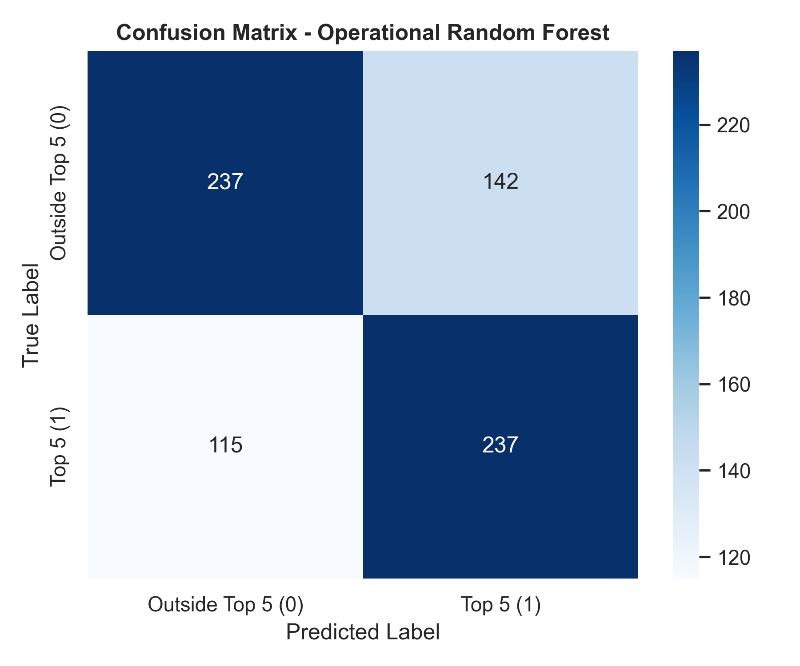
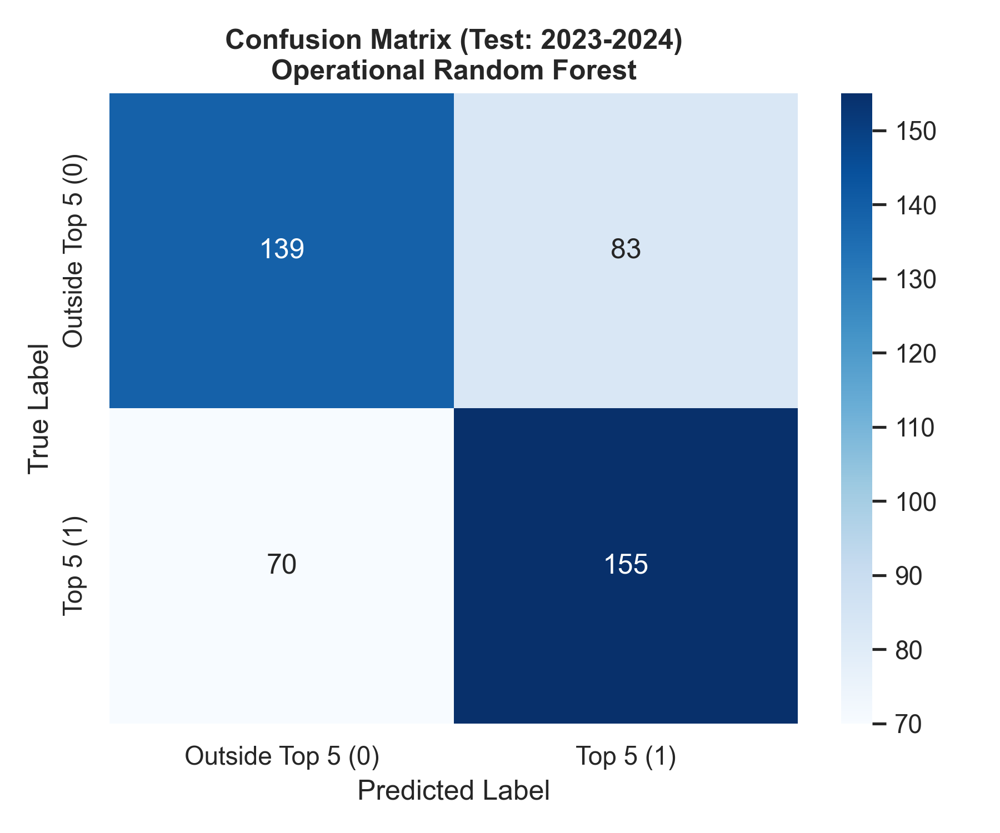
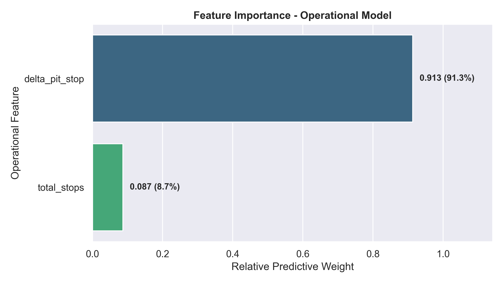

# F1 Pit Stop Efficiency: A Data Science Case Study

## Research Question

**Is pit-stop performance associated with a constructor's likelihood of holding a Top 5 position in the Constructors' Championship after a race?**

## Project Overview

This project analyzes Formula 1 pit-stop performance from 2011 to 2024 to investigate whether differences in pit-stop efficiency are associated with a constructor's championship standing.

The analysis was developed as an interdisciplinary university case study, integrating Data Engineering, Business Intelligence, Bayesian Probability, Econometrics, and Machine Learning into a single analytical workflow.

The project focuses on two operational aspects of pit-stop performance:

- **Pit-stop delta:** the difference between a constructor's average pit-stop duration and the average pit-stop duration across all constructors participating in the same race.
- **Total pit stops:** the number of pit stops performed by a constructor during a race.

A negative pit-stop delta indicates that a constructor's average pit stop was faster than the race-level benchmark, while a positive value indicates slower-than-average performance.

The dataset contains **2,923 constructor-race observations**, with each observation representing the performance of one constructor in one race.

The target variable identifies whether the constructor held a **Top 5 position in the Constructors' Championship after that race**.

## Project Objectives

The project aims to:

1. Build an integrated dataset combining race results, championship standings, and pit-stop data.
2. Develop a normalized metric to compare pit-stop performance across different races.
3. Analyze the relationship between pit-stop performance and championship standing.
4. Evaluate the statistical significance of the observed relationship.
5. Examine the conditional probability of a Top 5 championship standing based on pit-stop performance.
6. Assess whether pit-stop variables alone contain enough predictive signal to classify Top 5 championship standings using a Random Forest model.

## Dataset & Data Engineering

The analysis combines Formula 1 race, constructor championship, and pit-stop data covering the **2011–2024 seasons**.

The final dataset contains **2,923 constructor-race observations**, where each row represents the performance of one constructor in a single race.

### Data Sources

The project integrates three main types of information:

- **Race results:** race-level performance and points obtained by each constructor.
- **Constructor standings:** championship position and accumulated points after each race.
- **Pit-stop data:** individual pit-stop durations and the number of stops performed by each constructor.

### Data Engineering Pipeline

The raw datasets were processed through an ETL workflow designed to create a unified analytical dataset.

The main steps were:

1. **Data extraction and standardization** from the original Formula 1 datasets.
2. **Data cleaning**, including handling missing values and removing anomalous pit-stop observations.
3. **Pit-stop aggregation** to calculate constructor-level performance for each race.
4. **Race-level normalization** of pit-stop performance using a benchmark calculated from the constructors participating in each race.
5. **Data integration** by combining pit-stop performance, race results, and championship standings.
6. **Feature engineering** to create the variables required for the statistical and machine learning analyses.

### Pit-Stop Performance Metric

To make pit-stop performance comparable across different races, the project uses a normalized metric called **`delta_pit_stop`**.

For each constructor and race:

> **Pit-stop Delta = Constructor's Average Pit-Stop Duration − Race-Level Average Pit-Stop Duration**

Therefore:

- **Negative delta:** faster than the race-level average.
- **Positive delta:** slower than the race-level average.
- **Zero:** approximately equal to the race-level benchmark.

This approach avoids directly comparing raw pit-stop times across different races and seasons, where operating conditions and race circumstances may vary.

The final analytical dataset therefore combines both **pit-stop performance** and **championship standing** at the constructor-race level, providing the basis for the subsequent statistical, probabilistic, and machine learning analyses.

## Methodology

The project follows an interdisciplinary analytical approach, combining Data Engineering, Business Intelligence, Bayesian Probability, Econometrics, and Machine Learning to examine the relationship between pit-stop performance and championship standing.

### 1. Data Preparation and Feature Engineering

The raw datasets were cleaned, standardized, and integrated into a unified constructor-race dataset.

Pit-stop records were aggregated at the constructor-race level, and anomalous observations were removed to reduce the influence of non-standard pit-stop events.

The main analytical variables were:

- **`delta_pit_stop`** — normalized pit-stop performance relative to the race-level benchmark.
- **`total_stops`** — total number of pit stops performed by the constructor during the race.
- **`target_top5`** — binary indicator equal to 1 when the constructor held a Top 5 position in the Constructors' Championship after the race, and 0 otherwise.

### 2. Business Intelligence Analysis

A Business Intelligence layer was developed to explore the evolution of pit-stop performance and championship standings across constructors and seasons.

The dashboard provides a visual perspective of the main performance indicators and allows comparisons between pit-stop efficiency and championship outcomes.

This stage was used to identify patterns and relationships that were subsequently examined through statistical and machine learning methods.

### 3. Bayesian Probability Analysis

Bayesian analysis was used to examine the conditional probability of a Top 5 championship standing given above-average pit-stop performance.

The analysis compares:

- The overall probability of a constructor holding a Top 5 championship position.
- The probability of a Top 5 position among constructor-race observations with a negative `delta_pit_stop`.

This provides a probabilistic perspective on the relationship between pit-stop performance and championship standing.

### 4. Logistic Regression

A binary logistic regression model was developed to evaluate whether the pit-stop variables were statistically associated with the probability of a constructor holding a Top 5 championship position.

The model included:

- `delta_pit_stop`
- `total_stops`

Statistical significance was evaluated using the estimated coefficients and p-values.

The analysis was designed to identify whether the observed relationship provided statistical evidence of an association, rather than to establish a causal effect.

### 5. Random Forest Classification

A Random Forest classifier was developed using an **operational approach**, with only the two pit-stop variables used as predictors:

- `delta_pit_stop`
- `total_stops`

The objective was not to maximize prediction accuracy by incorporating all available championship information, but rather to evaluate whether pit-stop-related variables alone contained predictive signal regarding Top 5 championship standing.

The initial evaluation used a **75/25 train-test split**.

Model performance was evaluated using:

- Accuracy
- Precision
- Recall
- F1-score
- ROC-AUC
- Confusion matrix
- Feature importance

### 6. Temporal Validation

To evaluate whether the observed predictive performance was consistent when tested on future seasons, a second evaluation used a chronological split:

- **Training:** 2011–2022
- **Testing:** 2023–2024

This temporal holdout provides an additional perspective on model performance without relying on a random allocation of observations between training and test sets.

The purpose was to assess whether the relationship captured by the operational variables remained observable when the model was evaluated on later seasons.

## Key Findings

The analysis provides evidence of an association between pit-stop performance and a constructor's Top 5 championship standing after a race. However, the results also show that pit-stop variables alone are not sufficient to explain or accurately predict championship standing.

### Bayesian Probability Analysis

Across the full dataset, the observed probability of a constructor holding a Top 5 championship position after a race was **48.1%**.

Among observations where the constructor had a negative `delta_pit_stop` — meaning its average pit stop was faster than the race-level benchmark — the observed probability increased to **63.4%**.

This represents an **absolute difference of 15.3 percentage points**.

This result indicates an association between faster-than-average pit-stop performance and a higher observed probability of holding a Top 5 championship position. It should not be interpreted as evidence of a causal effect.

### Logistic Regression

The logistic regression analysis found that **`delta_pit_stop` was statistically significant** in its association with the probability of holding a Top 5 championship position.

The estimated coefficient for `delta_pit_stop` was **-0.9324**, with a p-value below **0.001**.

The negative coefficient indicates that higher pit-stop deltas — representing slower-than-average pit-stop performance — were associated with lower odds of holding a Top 5 championship position.

In contrast, **`total_stops` was not statistically significant** in the model (p = 0.306).

### Random Forest Classification

The operational Random Forest used only `delta_pit_stop` and `total_stops` as predictors.

Using a 75/25 train-test split, the model achieved:

| Metric | Result |
|---|---:|
| Accuracy | **64.84%** |
| ROC-AUC | **0.6983** |


The model showed moderate classification performance, indicating that the two pit-stop variables contain predictive signal, but are insufficient on their own to accurately classify championship standing.

### Temporal Validation

A second evaluation used a chronological split, training the model on **2011–2022** and testing it on **2023–2024**.

The model achieved:

| Metric | 2023–2024 Test Set |
|---|---:|
| Accuracy | **65.77%** |
| ROC-AUC | **0.7059** |


The similar performance across the two evaluation approaches suggests that the observed predictive signal was not solely dependent on the initial random train-test partition.

However, this temporal evaluation should not be interpreted as evidence that the model generalizes to all future Formula 1 seasons.

#### Confusion Matrix

The confusion matrix provides a more detailed view of the model's classification performance:

<p align="center">
  
  
</p>

<p align="center">
  <em>Left: Standard 75/25 train-test split &nbsp;&nbsp; | &nbsp;&nbsp; Right: Temporal validation (2011–2022 → 2023–2024)</em>
</p>

### Feature Importance

The Random Forest model relies exclusively on the two operational pit-stop variables used in the analysis.

<p align="center">
  
</p>

The feature importance analysis shows that the model's predictive signal is concentrated in the two pit-stop variables, with `delta_pit_stop` contributing more strongly than `total_stops`.

This is consistent with the statistical analysis, where `delta_pit_stop` was also the variable showing a statistically significant association with the target.

## Limitations

Several limitations should be considered when interpreting the results of this study.

### Association does not imply causation

The statistical and probabilistic analyses identify an association between pit-stop performance and championship standing. However, the study does not establish a causal relationship.

A constructor's championship position is influenced by many factors beyond pit-stop performance, including race pace, qualifying performance, reliability, strategy, incidents, and driver performance.

### Definition of the target variable

The `target_top5` variable represents whether a constructor held a **Top 5 position in the Constructors' Championship after a given race**.

It does not represent whether the constructor ultimately finished the season in the Top 5.

This distinction is important when interpreting both the statistical and machine learning results.

### Limited predictive scope

The Random Forest analysis intentionally uses only `delta_pit_stop` and `total_stops` as predictors.

Although the model identifies a measurable predictive signal, its performance is moderate, with an ROC-AUC of approximately **0.70** in both evaluation approaches.

This indicates that pit-stop variables alone cannot accurately explain or predict championship standing.

### Observational data

The analysis is based on historical Formula 1 race data from **2011 to 2024**. The results therefore describe patterns observed in this dataset and should not automatically be generalized to other motorsport categories, future seasons, or different racing regulations and operational conditions.

## Project Structure

The repository is organized into separate directories for data, analysis scripts, outputs, and documentation.

```text
Case-Study-F1-Pit-Stops-Efficiency/
│
├── data/
│
├── scripts/
│   ├── 01_cleaning_pitstps_results/
│   ├── 02_merge_principal_table/
│   ├── 03_random_forest_top5/
│   ├── 04_econometrics_logit/
│   └── 05_bayesian_probability/
│
├── outputs/
│   ├── bayesian_analysis/
│   ├── dashboards/
│   ├── econometrics/
│   └── machine_learning/
│
├── requirements.txt
└── README.md

```
## Technologies

### Programming & Data Analysis

- **Python** — Data processing, feature engineering, statistical analysis, and machine learning.
- **Pandas** — Data manipulation and dataset integration.
- **NumPy** — Numerical computations.
- **Scikit-learn** — Random Forest classification and model evaluation.
- **Statsmodels** — Logistic regression and statistical inference.
- **Matplotlib** — Data visualization and model evaluation plots.

### Business Intelligence

- **Microsoft Power BI** — Interactive dashboards and business intelligence analysis.

### Development & Reproducibility

- **Python Files** — Exploratory analysis and development.
- **Git & GitHub** — Version control and project management.
- **pip / requirements.txt** — Python dependency management.

## Reproducibility

The project was developed using Python and the dependencies listed in `requirements.txt`.

To reproduce the analysis:

1. Clone the repository.

2. Create and activate a Python virtual environment.

3. Install the required dependencies:

```bash
pip install -r requirements.txt
```

4. The numbered scripts reflect the analytical workflow, beginning with data cleaning and engineering and continuing through the statistical and machine learning analyses.

Pre-generated outputs are also included in the outputs/ directory to allow the results to be reviewed without running the complete pipeline.

## Conclusion 

This study found evidence of an association between pit-stop performance and a constructor's likelihood of holding a Top 5 position in the Constructors' Championship after a race.

The Bayesian analysis showed an observed Top 5 probability of **63.4%** among constructor-race observations with a negative pit-stop delta, compared with **48.1%** across the overall dataset. Logistic regression also identified `delta_pit_stop` as a statistically significant variable in its association with the target.

At the same time, the Random Forest analysis demonstrated that pit-stop performance alone provides only **moderate predictive signal**. The operational model achieved an ROC-AUC of **0.6983** using a standard 75/25 split and **0.7059** when trained on 2011–2022 and evaluated on 2023–2024.

These results support the existence of a measurable relationship between pit-stop performance and championship standing, while also highlighting that pit stops represent only one component of a much more complex competitive system.

Overall, the project demonstrates how an interdisciplinary data science workflow can be applied to a motorsport problem, combining data engineering, business intelligence, statistical inference, probability, and machine learning to investigate a specific performance question.